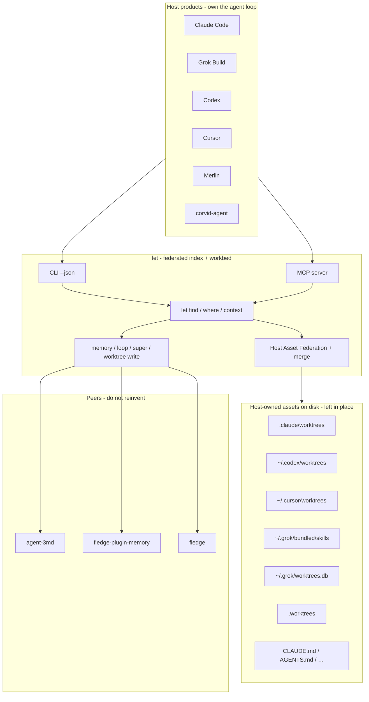
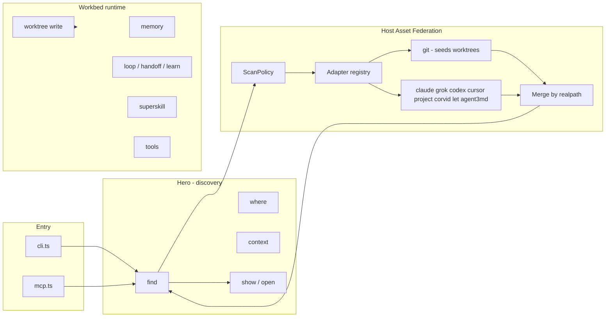
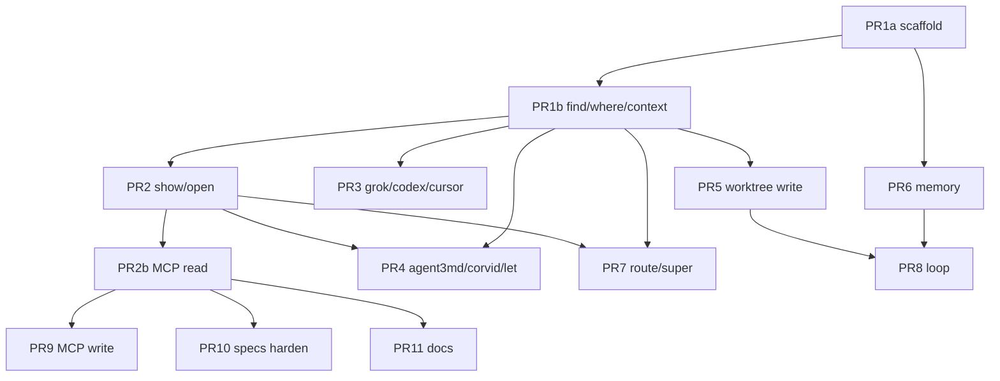

# `let` — Universal Agent-Asset Locator + Dynamic Workbed

| Field | Value |
|-------|--------|
| **Title** | `let`: Find anything agent for any agent — host-neutral workbed |
| **Author** | CorvidLabs / 0xLeif (Leif) |
| **Date** | 2026-07-30 |
| **Status** | Draft (rev 4 — scope branch, show sessions metadata-only, limits) |
| **Repo** | `/Users/leif/Development/_CorvidLabs/let` (greenfield) |
| **Org** | CorvidLabs |

---

## Overview

Coding agents each hide their assets in private layouts. Claude puts checkouts under `<repo>/.claude/worktrees/wf_*`. Codex links trees under `~/.codex/worktrees/<id>/<repo>`. Cursor uses `~/.cursor/worktrees/`. Grok stores skills under `~/.grok/bundled/skills` and indexes worktrees in `~/.grok/worktrees.db`. Project rules live as `CLAUDE.md`, `AGENTS.md`, `.cursorrules`. A Grok session in `quill` cannot natively see Claude’s worktrees; a Claude session cannot route Grok’s skills. Discovery is ad hoc grepping — when it happens at all.

**`let` is first a universal agent-asset locator, then a dynamic workbed.** Any host agent should be able to run:

```bash
let where .                         # what agent stuff is here?
let find worktrees --json           # every known worktree for this repo (deduped)
let find skills --json              # Claude + Grok + agent.3md + project
let find agents --json
let find sessions --json            # path-only index cards in v0
let find memory --json
let find instructions --json
let context                         # unified context pack for cwd/project
```

…and get a **federated index of host-owned paths that already exist**, not only assets `let` creates under `.let/`.

**Federation over relocation:** `let` indexes assets *in place*. It does not migrate `.claude/worktrees/` into `.let/`. Writes may optionally create under `.let/worktrees/`; reads always union all known hosts with a **formal merge by realpath** so git + host dirs never double-count.

On top of that spine, `let` also provides workbed runtime: superskills, local memory, loops/handoffs/learn, tools registry, MCP export. Implementation is **TypeScript on Bun**, JSON-first, with **minimal catalog specs from PR1** and full spec-hardening before publish.

### Concrete workflows (acceptance examples)

**Grok agent in quill** discovers Claude + Codex trees (unique realpaths):

```bash
cd /Users/leif/Development/_CorvidLabs/quill
let find worktrees --json
# One card per realpath (git seeds + host overlays). Illustrative hosts:
#   host=claude path=…/quill/.claude/worktrees/wf_524fb7b1-116-1 branch=worktree-wf_…
#   host=codex  path=…/.codex/worktrees/97c2/quill
#   host=codex  path=…/.codex/worktrees/97c2/quill/.worktrees/feat-sdd-evidence-refresh
#   host=project path=…/quill/.worktrees/feat-stt-transcribe-harness
#   host=git    path=/private/tmp/quill-pr572-review status=prunable
# Acceptance (quill-shaped fixture): N unique realpaths == |git porcelain ∪ host-only|,
# zero duplicate paths, host labels match path-prefix table; N ≈ |git worktree list|
# when every host dir is also git-linked (common on quill today).
```

**Claude agent** discovers Grok + project skills:

```bash
let find skills --scope project --json   # project-attributable skills (default)
let find skills --scope all --json       # explicit cross-project / user-global
```

**Any agent** standing in a dirty checkout:

```bash
cd …/quill/.claude/worktrees/wf_524fb7b1-116-3
let where .
# -> host=claude, kind=worktrees, branch=…, repo_root=…/quill (via git common-dir),
#    related.sibling_worktrees=[…], related.instructions=[…],
#    related.sessions=[]  # v0: empty or path-only ids; no cross-host correlation
```

---

## Background & Motivation

### Observed host layouts (this machine, 2026-07-30)

| Host | Project-scoped | User-scoped | Worktrees / notes |
|------|----------------|-------------|-------------------|
| **Claude Code** | `<repo>/.claude/{worktrees,skills,commands,agents,settings*}` | `~/.claude/{skills,agents,plugins,tasks}`; **sessions under `~/.claude/projects/<path-encoded>/*.jsonl`** (not empty `~/.claude/sessions`) | `quill/.claude/worktrees/wf_524fb7b1-116-*` — real git worktrees, all in `git worktree list`. Project encoding e.g. `…merlin--worktrees-spec-fixes`. |
| **Grok Build** | `<repo>/.grok/skills/` | `~/.grok/{bundled/skills,sessions,workflows,memtrace,config.toml}`; **`~/.grok/worktrees.db`** (SQLite registry: path, source_repo, repo_name, kind, status, session_id, …) | Sessions URL-encoded under `~/.grok/sessions/`. Worktree index is first-class enrichment, not a checkout root. |
| **Codex** | (via linked trees) | `~/.codex/worktrees/<id>/<repo>/` **and nested** `.worktrees/<name>/` | `~/.codex/worktrees/97c2/quill` + 7 nested trees; all git-listed; common-dir → quill `.git`. Root can be **~20 GB** of full checkouts — shallow scan only. |
| **Cursor** | `.cursor/rules`, `.cursorrules` | `~/.cursor/{worktrees,skills-cursor,plans,chats,projects}` | `~/.cursor/worktrees/site.nature.leif.algo` observed as **empty placeholder** (not a git worktree) — adapters emit `status=unknown`, no branch claim. |
| **Project convention** | `<repo>/.worktrees/<name>` | — | quill: several named trees, git-linked. |
| **Git** | `git worktree list` + `.git/worktrees` | — | Source of truth for *linked* trees (seeds federation). |
| **corvid-agent** | `WORKTREE_BASE_DIR` / sibling worktrees | platform memory | Documented `git worktree add … -b work/<id>` |
| **let (new)** | `.let/{worktrees,memory,sessions,…}` | `~/.let/` | Optional *write* target; always one *read* source among many |

### Pain points

1. **Assets are host-private** across Claude/Grok/Codex/Cursor.
2. **Multiple truth sources for worktrees** — git list necessary but host metadata and registries (Grok DB) still needed; naive concat double-counts.
3. **Skills/instructions fragmented** across formats and roots.
4. **No progressive-disclosure catalog** — agents dump whole files into context.
5. **Creating a new silo (only `.let/`)** would worsen the problem if reads ignored existing host paths.
6. **Home roots are huge** — federation must not recurse into full checkout trees under `~/.codex/worktrees`.

### Positioning



---

## Goals & Non-Goals

### Goals

1. **Find anything agent for any agent** — federated discovery without relocating host assets.
2. **Hero surface:** `let find`, `let where`, `let context` (+ progressive `let show` / `let open`).
3. **Pluggable host adapters** with formal merge, stable ids, and ScanPolicy.
4. **Unified worktree view** — git seeds + host attribution overlays + optional DB enrichment (Grok).
5. **JSON-first, non-interactive API** (`--json`, stable exit codes, concrete MCP schemas).
6. **Workbed runtime** secondary on the same catalog spine.
7. **Dynamic / Bun-fast** — TypeScript, shallow scans, optional cache.
8. **Spec-backed contracts from PR1** for catalog/envelope/`FindKind`/adapter obligations; expand coverage before publish (not “specs only at the end”).

### Non-Goals

| Concern | Owner |
|---------|--------|
| Full multi-agent platform, AlgoChat, councils, UI | **corvid-agent** |
| App-first runner, provider matrix, desktop | **merlin** |
| One-file agent format (route→fill→run) | **agent-3md** |
| Multi-plane markdown base | **3md** |
| Dev lifecycle templates/lanes/release | **fledge** |
| Three-tier on-chain memory product | **fledge-plugin-memory** (optional bridge) |
| Host UX (slash menus, TUI) | Host products |
| Migrating host assets into `.let/` by default | **Anti-goal** |
| Model loop / provider keys | **Anti-goal** for v0 |
| AGI self-modification | **Anti-goal** |
| Deep session transcript parsing / cross-host session correlation | **Post-v0** |
| Windows as first-class CI target | **Post-v0** (macOS/Linux first) |

---

## Proposed Design

### Mental model

```text
let find <kind> [filters] --json     # federated index cards (deduped)
let where [path] --json              # classify path + related (v0: no session promise)
let context [--pack] --json          # unified context pack for cwd
let show <kind> <id> --json          # progressive full load
let open <path>                      # path → card (+ optional preview)
let <runtime-surface> …              # worktree write, memory, loop, super, tool
```

### Architecture



### Directory layout

```text
let/
├── package.json                 # @corvidlabs/let, bin: let
├── bun.lock
├── tsconfig.json
├── biome.json
├── fledge.toml
├── LICENSE / README / AGENTS.md / CLAUDE.md
├── bin/let                      # #!/usr/bin/env bun
├── src/
│   ├── cli.ts
│   ├── mcp.ts
│   ├── index.ts
│   ├── envelope.ts              # JSON envelope + error codes
│   ├── errors.ts                # LetError code enum; CLI/MCP/library mapping
│   ├── config.ts                # merge user vs project trust layers
│   ├── paths.ts
│   ├── doctor.ts
│   ├── catalog/
│   │   ├── types.ts
│   │   ├── find.ts
│   │   ├── where.ts
│   │   ├── context.ts
│   │   ├── show.ts
│   │   ├── merge.ts             # worktree (and generic) realpath merge
│   │   ├── scan-policy.ts
│   │   └── cache.ts
│   ├── adapters/
│   │   ├── types.ts
│   │   ├── registry.ts
│   │   ├── git.ts
│   │   ├── claude.ts
│   │   ├── grok.ts              # skills + sessions + worktrees.db
│   │   ├── codex.ts
│   │   ├── cursor.ts
│   │   ├── project.ts
│   │   ├── corvid.ts
│   │   ├── let.ts
│   │   └── agent3md.ts
│   ├── skill/
│   ├── superskill/
│   ├── worktree/
│   ├── memory/
│   ├── loop/
│   ├── tool/
│   └── plugins/loader.ts
├── specs/
│   ├── catalog/                 # present from PR1 (minimal)
│   ├── adapters/                # present from PR1 (obligations)
│   ├── skill/ superskill/ worktree/ memory/ loop/ tool/ mcp/ cli/
├── test/
│   ├── fixtures/hosts/          # quill-shaped multi-host layout
│   └── *.test.ts
└── scripts/gen-from-specs.ts
```

**Scaffold:** PR1 is hand-aligned with **`fledge` `ts-bun` template** conventions (`package.json` scripts, biome, `fledge.toml` tasks). Prefer `fledge create` / template copy when generating the repo; do not invent a divergent layout.

**Bin naming:** package `@corvidlabs/let`, executable `let`. Document `bunx let` / `bun link` because `let` is a common English word and a JS keyword — always show shell invocation as the binary name on PATH, not as bare JS.

---

### Host Asset Federation

#### Adapter contract

```ts
type HostId =
  | "claude" | "grok" | "codex" | "cursor" | "git"
  | "project" | "corvid" | "let" | "agent3md" | "unknown";

type FindKind =
  | "instructions" | "skills" | "agents" | "commands"
  | "worktrees" | "sessions" | "tasks" | "memory"
  | "mcp" | "plugins" | "workflows" | "superskills";

/**
 * Stable identity: kind + content identity, NOT host.
 * Host is a mutable attribution field after merge overlays.
 */
// worktrees: `worktrees:${sha256(realpath).slice(0,16)}`
// skills:    `skills:${host}:${slug(name)}:${sha256(realpath).slice(0,12)}`  // host ok for skills (path-unique)
// Prefer path-hash for anything that can be re-attributed across hosts.

interface IndexCard {
  id: string;
  kind: FindKind;
  host: HostId;
  name: string;
  path: string;                  // realpath when exists
  description?: string;
  triggers?: string[];
  repo_root?: string;
  branch?: string;
  status?: string;
  managed_by?: HostId;
  scope: "project" | "user" | "global";
  mtime_ms?: number;
  meta?: Record<string, unknown>;
}

interface AssetBody extends IndexCard {
  body?: string;
  payload?: unknown;
}

interface HostAdapter {
  readonly id: HostId;
  kinds(): FindKind[];
  /** Emit seed cards and/or overlays. Never throws for missing dirs. Never writes. */
  find(kind: FindKind, ctx: ScanContext): Promise<IndexCard[]>;
  show?(ref: IndexCard, ctx: ScanContext): Promise<AssetBody | null>;
}
```

#### Scope semantics (critical)

| Scope | Meaning |
|-------|---------|
| **`project`** (default) | Assets **attributable to `repoRoot`**, wherever stored. May **query** configured user roots (`~/.codex/worktrees`, …) but **only emit** cards whose git common-dir (or declared project binding) matches current `repoRoot`. |
| **`user`** | User-global assets **not** filtered by repo (user skills, global agents, all Codex trees as unfiltered list — use carefully). |
| **`all`** | Union of project-attributable + user-global. |

**Kind-specific:**

| Kind | Scope behavior |
|------|----------------|
| `instructions` | Always walk cwd→repoRoot (and nested instruction files); ignore user-home instruction dumps. |
| `worktrees` | See merge: **`project`** filters host candidates with `belongsToRepo` / checkout-root rules; **`user`/`all`** emit all ScanPolicy host candidates (git seed still current-repo porcelain only). |
| `skills` / `agents` / `commands` / `workflows` | **Single rule:** `scope=project` = **project skill dirs ∪ user/bundled skill catalogs** (global tools available in any project). Controlled by user config `find.include_user_skills` (**default `true`**; opt-out in `~/.let/config.toml` only — not project config). `scope=user` = user/bundled only; `scope=all` = union. Worktrees/sessions/memory stay repo-filtered under `project` (not this rule). |
| `sessions` / `tasks` | `project` = sessions bound to this repo (Claude: decode project encode matching repo path; Grok: session path encode). **Find = path-only cards.** |
| `memory` | project DB vs user DB by scope. |

**Skills rationale:** “find skills for this project” means “what can an agent load here,” including user-global catalogs — not “skills whose files live under repoRoot only.”

#### ScanContext

```ts
interface ScanContext {
  cwd: string;
  repoRoot: string | null;       // git toplevel from cwd (or parent common-dir)
  repoCommonDir: string | null;  // realpath(git rev-parse --git-common-dir)
  home: string;
  config: LetConfig;
  scope: "project" | "user" | "all";
  targetPath?: string;
  policy: ScanPolicy;
  limit?: number;                // max cards returned after merge
}
```

When **cwd is inside a linked worktree**, resolve `repoRoot` / `repoCommonDir` via git common-dir (not the worktree path as “root”). **v0 default for `where`/`context`/`find --scope project`:** always the **parent repository** identified by common-dir. (Key Decision: Open Q2.)

---

### ScanPolicy (security + performance)

```ts
interface ScanPolicy {
  /** Only these root templates may be listed (expanded with home/repoRoot). */
  allowedRoots: string[];
  /** Max directory depth from each adapter root. */
  maxDepth: number;
  /** Never follow symlinks that escape the adapter root realpath. */
  followSymlinks: "never" | "within-root";
  /** Cap filesystem ops / time per find call. */
  maxEntriesPerRoot: number;
  maxDurationMs: number;
  /** Refuse to open as body/show. */
  denyFileBasenames: string[];  // auth.json, history.jsonl, *.pem, ...
}
```

**v0 fixed policy (not free-form CLI paths as scan roots):**

| Adapter root template | maxDepth | Notes |
|----------------------|----------|--------|
| `<repo>/.claude/worktrees` | 1 | list immediate children only |
| `<repo>/.worktrees` | 1 | |
| `<repo>/.let/worktrees` | 1 | |
| `<repo>/.claude/skills` etc. | 2 | skill dir + SKILL.md |
| `~/.codex/worktrees` | **2** | `<id>/<repoName>` only; then optional **+1** for `.worktrees/<name>` under a matched repo checkout — **do not** recurse into `src/`, `node_modules/`, `crates/` |
| `~/.cursor/worktrees` | 2 | tolerate empty non-git dirs |
| `~/.claude/projects` | 1 | list encoded project dirs; open jsonl names only when kind=sessions |
| `~/.grok/bundled/skills` | 2 | |
| `~/.grok/worktrees.db` | 0 | open SQLite read-only; no FS walk |
| git | 0 | `git worktree list --porcelain` only |

**Rules:**

1. Adapters never accept arbitrary user-supplied scan roots for federation (only `--cwd` / `--repo` to set context).
2. `followSymlinks = within-root`: if `realpath(child)` is outside `realpath(adapterRoot)`, skip.
3. **Project-scope** may *list* user roots but **filters emissions** by common-dir match (worktrees) or kind rules above.
4. **MCP** defaults `scope=project`. Document that `scope=all` is a **cross-project enumeration API** under local trust; hosts should not enable casually.
5. Never `show`/body-load: `auth.json`, `history.jsonl`, `*.pem`, `*.key`, credential stores, `managed_config` secrets. **Sessions/tasks show is metadata-only** (see Progressive disclosure) — never load transcript jsonl bodies.
6. **Card limit (uniform):** `DEFAULT_LIMIT = 100`, `MAX_LIMIT = 500` for CLI, library, and MCP. When the full set exceeds the limit, return the first `limit` cards after sort and set `meta.truncated = true`, `meta.total = <pre-limit count>`. Doctor reports root existence and **directory entry counts** (not full du of 20 GB trees — shallow `readdir` stats).
7. Concurrent FS: bounded pool (e.g. 8) for existence checks / `git rev-parse` in codex matching.

---

### Worktree federation — formal algorithm

#### Id stability

```text
id = "worktrees:" + sha256_hex(realpath(path))[0..16]
```

**Host is never part of the worktree id.** Re-attribution from `git` → `claude` does not change `id`. `show worktree <id>` remains stable.

#### Merge procedure (normative)

```text
function federateWorktrees(ctx):
  cards = Map<realpath, WorktreeCard>()

  # 1) SEED from git — always current-repo porcelain only (project-bound).
  #    Under scope=user|all this still only seeds *this* repo's linked trees;
  #    other repos appear via host scans without git seed for those repos.
  if ctx.repoRoot:
    for entry in git_worktree_list_porcelain(ctx.repoRoot):
      rp = realpath(entry.path)
      cards[rp] = {
        id: worktreeId(rp),
        kind: "worktrees",
        path: rp,
        host: "git",              # provisional
        managed_by: "unknown",
        branch: entry.branch,     # or null if detached
        head: entry.head,
        status: mapGitStatus(entry),  # active | prunable | detached
        repo_root: ctx.repoRoot,
        scope: "project",
        meta: { git_listed: true, host_dir: false }
      }

  # 2) HOST DIR SCANS → overlays (not second seeds when path exists)
  for adapter in [claude, project, let, codex, cursor, corvid]:
    for path in adapter.listWorktreeCandidates(ctx, ScanPolicy):
      rp = realpath_or_skip(path)
      # Scope branch (required):
      #   project → only repo-attributable checkouts
      #   user|all → emit all candidates under ScanPolicy roots (still shallow)
      if ctx.scope == "project" and not isWorktreeCandidateForRepo(rp, ctx):
        continue
      host = attributeHost(rp)                  # path-prefix table
      if rp in cards:
        overlay(cards[rp], host, pathExists=true)
      else:
        cards[rp] = hostOnlyCard(rp, host)

  # 3) GROK worktrees.db enrichment — match order (never repo_name alone):
  #   (1) realpath(row.path) already in cards → overlay meta
  #   (2) else if scope allows and isWorktreeCandidateForRepo / user-all insert
  #   (3) else skip
  for row in read_grok_worktrees_db():
    rp = realpath_or_skip(row.path)
    if rp is null: continue
    if rp in cards:
      cards[rp].meta.grok_db = summarize(row)   # status, session_id, kind, …
      # path-prefix host wins; only re-tag provisional git → grok if no prefix host
      if cards[rp].host == "git":
        cards[rp].host = "grok"
      continue
    if ctx.scope == "project":
      if not isWorktreeCandidateForRepo(rp, ctx): continue
    # scope user|all: insert any resolvable path under policy (shallow existence)
    cards[rp] = cardFromGrokRow(row)

  return applyLimit(sortWorktrees(cards.values()), ctx.limit ?? DEFAULT_LIMIT)
```

#### Overlay field priority (pseudocode)

```text
function overlay(card, hostFromPath, pathExists):
  card.meta.host_dir = pathExists
  card.meta.git_listed = card.meta.git_listed ?? false
  card.meta.also_in_git = card.meta.git_listed

  # host / managed_by: path-prefix specificity wins over provisional "git"
  if hostFromPath != "unknown":
    card.host = hostFromPath
    card.managed_by = hostFromPath

  # branch / head / status: git porcelain wins when git_listed
  if not card.meta.git_listed:
    card.branch = readBranchIfGit(card.path) ?? undefined
    card.status = pathExists ? (isGitCheckout(card.path) ? "active" : "unknown") : "missing"
  else:
    # keep git branch/head/status; if dir missing on disk, status = missing
    if not pathExists: card.status = "missing"

  # non-git placeholder dirs (empty Cursor folder):
  # status = "unknown", branch unset, meta.non_git = true
```

#### Path-prefix → host table (most specific first)

| Prefix / pattern | host |
|------------------|------|
| `<repo>/.claude/worktrees/` | `claude` |
| `~/.codex/worktrees/` | `codex` |
| `~/.cursor/worktrees/` | `cursor` |
| `<repo>/.let/worktrees/` | `let` |
| `<repo>/.worktrees/` | `project` |
| corvid configured base | `corvid` |
| else if git_listed only | `git` |

Nested Codex: `~/.codex/worktrees/97c2/quill/.worktrees/foo` → still **`codex`** (prefix under `~/.codex/worktrees/`).

#### Nested Codex scan depth

Under `~/.codex/worktrees/`:

1. Depth-1: `<id>/`
2. Depth-2: `<id>/<repoName>/` — candidate checkout; run common-dir match
3. If `isWorktreeCandidateForRepo` (or scope user|all): also list **one level** of `<id>/<repoName>/.worktrees/*` as additional candidates

Do **not** walk deeper.

#### Repo / checkout matching (Key Decision)

Naive `git -C <path> rev-parse --git-common-dir` **false-positives** on any subdirectory of a repo (e.g. `quill/crates` → quill common-dir). Do **not** use bare common-dir equality for arbitrary paths.

```text
function isWorktreeCandidateForRepo(path, ctx) -> bool:
  rp = realpath(path)

  # (1) Already a linked worktree of this repo
  if rp in git_porcelain_paths(ctx.repoRoot):
    return true

  # (2) Immediate child of a configured *in-repo* worktree base
  #     (.claude/worktrees, .worktrees, .let/worktrees, corvid base under repo)
  if isImmediateChildOfInRepoWorktreeBase(rp, ctx.repoRoot):
    return true   # accept even if not yet git-listed (host-only)

  # (3) External candidates only (Codex / Cursor / corvid-outside-repo / Grok paths):
  #     must be a *checkout root*, not a nested subdir
  if isUnderExternalWorktreeRoot(rp):  # ~/.codex/worktrees, ~/.cursor/worktrees, …
    toplevel = git -C rp rev-parse --show-toplevel   # fail → not a git checkout
    if realpath(toplevel) != rp:
      return false   # nested subdir of some checkout — reject
    common = realpath(git -C rp rev-parse --git-common-dir)
    return common == ctx.repoCommonDir

  return false
```

**Optional fast prefilter (external only):** basename of candidate equals basename of `repoRoot` (or config alias list) before spawning git — never sufficient alone.

**Failure modes:**

| Case | Behavior |
|------|----------|
| Plain dir inside main tree (not worktree child) | Rejected by (1)(2); common-dir alone must not accept |
| Non-git under `~/.codex/worktrees` | `status=unknown` card only for `scope=user\|all`; skipped for `project` |
| Empty Cursor placeholder | Same: unknown / host-only under user\|all; project only if somehow repo-linked |
| Incomplete detached checkout | If show-toplevel == path and common-dir matches → accept |
| Permission denied | skip candidate; doctor can warn |
| `~/.codex/worktrees` huge | shallow readdir only; git only on prefiltered candidates |

#### Acceptance fixture (quill-shaped)

Golden test under `test/fixtures/hosts/quill-shaped/`:

- Simulated git porcelain with 25 paths (claude + codex root + nested + project + tmp prunable)
- Host dirs that re-list the same paths
- Nested codex `.worktrees/*`
- Empty cursor placeholder

**Assert:** `find worktrees` → unique realpath count = set size of all sources; no path appears twice; ids stable across re-run with host overlay order shuffled; host labels match table; empty cursor → `status=unknown` without branch.

---

### Built-in adapter path map (v0)

| Adapter | Kinds | Paths (read) |
|---------|-------|----------------|
| **git** | worktrees | `git worktree list --porcelain` only (seed) |
| **claude** | worktrees, skills, agents, commands, sessions, tasks, plugins | Project: `.claude/worktrees/*`, `skills/`, `commands/`, `agents/`. User: `~/.claude/{skills,agents,plugins,tasks}`; **sessions/tasks index:** `~/.claude/projects/<encoded>/*` (jsonl names as cards — path-only in v0). Never `history.jsonl` as body. |
| **grok** | skills, sessions, workflows, worktrees (enrichment), memory (memtrace index meta only) | `.grok/skills`; `~/.grok/bundled/skills`, `~/.grok/skills`, `~/.grok/sessions`; **`~/.grok/worktrees.db`** read-only (`SELECT` path/source_repo/repo_name/status/session_id); schema may evolve — tolerate missing columns |
| **codex** | worktrees, agents | Shallow `~/.codex/worktrees` as above; `~/.codex/agents` if present |
| **cursor** | worktrees, skills, sessions (plans/chats as session meta paths) | Shallow `~/.cursor/worktrees`; `skills-cursor`; project `.cursor/rules`, `.cursorrules` |
| **project** | worktrees, instructions | `.worktrees/*`; root + nested instruction files |
| **corvid** | worktrees, skills | `WORKTREE_BASE_DIR`, `.corvid-worktrees`; project `skills/` |
| **let** | managed kinds | `.let/*`, `~/.let/*` |
| **agent3md** | skills, agents | `agent.3md` / globs via `@corvidlabs/agent3md` |

Adapters **must:** skip missing roots; never write on find; dedup responsibility is **merge layer** for worktrees (adapters may emit overlays with `meta.overlay_only=true` when path already known optional optimization).

---

### Progressive disclosure

| Command | Returns |
|---------|---------|
| `let find skills` | Cards without bodies |
| `let show skill <id\|name>` | Full body (SKILL.md / plane) |
| `let find worktrees` | Cards: path, branch, host, status |
| `let show worktree <id>` | Enriched HEAD/dirty if cheap |
| `let show sessions\|tasks <id>` | **Metadata only** — see below |
| `let open <path>` | Classify → card + optional small preview (capped bytes); **refuse** transcript/jsonl session files as preview body |

#### `show` policy for sessions and tasks (v0 security)

`find sessions` / `find tasks` return **path-only** index cards.  
`show sessions` / `show tasks` **must not** load transcript or jsonl **bodies**:

```ts
// AssetBody for kind sessions | tasks
{
  ...IndexCard,
  body: undefined,                    // always omitted in v0
  payload: {
    bytes: number,                    // file size
    mtime_ms: number,
    // no messages, no transcript text
  }
}
```

- CLI and MCP share this rule. A future opt-in (post-v0) may add redacted excerpts behind an explicit flag; **default remains metadata-only**.
- `open` on a session jsonl path returns classification + size/mtime only, never file contents.

#### Skill federation (non-worktree) merge / sort / query

Worktree merge is realpath-dedupe. **Skills are intentionally multi-card** (same name, different hosts/paths) with ids `skills:${host}:${slug}:${pathHash}`.

| Rule | Behavior |
|------|----------|
| **Merge** | Concat by stable `id` (path-unique). No cross-host collapse. |
| **Sort** | (1) project-local paths first (`scope` field / path under repoRoot), (2) then `host`, (3) then `name` ascending. |
| **`--query`** | Case-insensitive substring match on `name`, `description`, and `triggers` joined; filter then sort. |
| **Ranking** | `let skill route` (PR7) owns trigger scoring; `find` does not rank by ML/relevance beyond query filter + sort. |
| **Limit** | After sort, apply `DEFAULT_LIMIT` / `--limit`; set `meta.truncated` + `meta.total`. |

---

### Hero commands (detail)

#### `let find`

```bash
let find <kind> [--scope project|user|all] [--host <id>] [--repo <path>]
              [--query <text>] [--cwd <path>] [--limit N] [--json]
```

#### `let where` — v0 contract

Always returns:

- `path`, `kind`, `host`, `repo_root`, `branch?`, `status?`, `id?`
- `related.sibling_worktrees` — other worktree cards for same `repo_root` (from federated set)
- `related.instructions` — instruction paths from stack discovery
- `related.sessions` — **`[]` in v0**, or optional path-only session cards if trivially available; **no cross-host correlation**, no transcript bodies

```json
{
  "path": "…/quill/.claude/worktrees/wf_524fb7b1-116-3",
  "kind": "worktrees",
  "host": "claude",
  "id": "worktrees:a1b2c3d4e5f67890",
  "repo_root": "…/quill",
  "branch": "worktree-wf_524fb7b1-116-3",
  "related": {
    "sibling_worktrees": ["worktrees:…", "worktrees:…"],
    "instructions": ["…/quill/AGENTS.md", "…/quill/CLAUDE.md"],
    "sessions": []
  }
}
```

#### `let context` — instruction stack order

Walk **cwd → parents until repoRoot** (inclusive). At each directory, collect files in **file precedence** (later override / higher priority for “closer wins”):

**Per-directory file priority (high → low within same dir):**

1. `AGENTS.md`
2. `AGENT.md`
3. `CLAUDE.md`
4. `.cursorrules`
5. `.cursor/rules/*` (sorted by path)

**Across directories:** deeper (closer to cwd) **wins** over higher directories for the same conceptual role — stack is emitted **root → cwd** order (general first, specific last) so agents append-specific context last.

| Pack | Bodies |
|------|--------|
| `brief` | Paths + short digests/hashes only; skill **counts by host**; worktree **counts by host**; memory **key list** not values; **sessions never included** |
| `full` | Instruction **bodies** included (size-capped per file, default 64 KiB); skills still cards only; **still no session path lists or bodies** — agents use `let find sessions` explicitly |

---

### Worktree module (read vs write)

| Operation | Behavior |
|-----------|----------|
| **Read** | `let find worktrees` / `where` only via federation merge |
| **Write `let worktree add`** | Default `.let/worktrees/<name>`, branch `let/<name>` |
| **Cleanup** | Let-managed only by default |

---

### Workbed runtime — minimal implementable schemas

#### Memory (SQLite `.let/memory.db` or `~/.let/memory.db`)

```sql
PRAGMA user_version = 1;

CREATE TABLE memories (
  key TEXT PRIMARY KEY,
  value TEXT NOT NULL,
  tags TEXT NOT NULL DEFAULT '[]',
  created_at TEXT NOT NULL,
  updated_at TEXT NOT NULL,
  expires_at TEXT
);
```

Migrations: numbered files `src/memory/migrations/00N_*.sql`; refuse unknown `user_version` without migration.

CLI: `let memory save --key k --value v [--ttl hours]`, `recall --key|--query`, `list`, `delete --key`.

#### Loop / handoff / learn (files under `.let/`)

```text
.let/loops/<loopId>.json
.let/handoffs/<handoffId>.json
.let/learnings/<learningId>.json
.let/skills/_drafts/<name>/SKILL.md
```

```ts
// LoopRecord
{
  id: string;
  name: string;
  status: "planned" | "running" | "blocked" | "reflecting" | "done" | "failed";
  steps: Array<{ id: string; type: "skill" | "super" | "tool" | "action"; ref: string }>;
  cursor: number;
  worktreeId?: string;
  createdAt: string;
  updatedAt: string;
}

// HandoffPackage
{
  id: string;
  loopId: string;
  toRole: string;
  goal: string;
  contextDigest: string[];   // instruction paths
  skillHits: string[];       // skill ids
  memoryKeys: string[];
  worktreeId?: string;
  nextSteps: string[];
  createdAt: string;
}

// LearningArtifact
{
  id: string;
  loopId?: string;
  summary: string;
  lessons: string[];
  draftSkillPath?: string;
  createdAt: string;
}
```

#### Superskill file format (v0 decision)

**TOML** under `.let/superskills/<name>.toml` (Open Q4 decided for v0):

```toml
name = "ship-fix"
description = "Diagnose, implement in worktree, verify"
triggers = ["ship fix", "fix and PR"]

[[steps]]
id = "diagnose"
skill = "code-review"

[[steps]]
id = "isolate"
run = "let worktree add"
# args reserved for later
```

Validate: skill refs must resolve via federated `find skills` or warn; no cycles in step graph (linear v0).

---

### Config trust layers

```toml
# ~/.let/config.toml  — TRUSTED (user)
# .let/config.toml    — PARTIALLY UNTRUSTED (repo)

[let]
version = 1

[find]
default_scope = "project"
default_limit = 100            # DEFAULT_LIMIT; max 500
cache_ttl_ms = 5000
include_user_skills = true     # user config only; project file cannot force true if user set false
# adapters list in project config can only DISABLE, not enable home-root adapters
# beyond user allowlist

[worktree]
write_target = "let"
base_dir = ".let/worktrees"
branch_prefix = "let/"
default_base = "main"

[memory]
default_scope = "project"

# Security-sensitive keys: ONLY from ~/.let/config.toml or env (ignore in project file)
# LET_SHELL_ALLOWLIST, LET_TOOL_RUN, LET_ALLOW_FOREIGN_CLEANUP,
# LET_ENABLE_USER_ROOT_ADAPTERS=0 for CI
```

**Project `.let/config.toml` may set:** paths, write_target, non-security adapter prefs, cache_ttl.  
**Must not expand:** shell allowlist, `tool_run_enabled`, `allow_cleanup_foreign_worktrees`, enabling home-root adapters if user disabled them.  
**CI recommendation:** `LET_ENABLE_USER_ROOT_ADAPTERS=0` and `scope=project` so runners do not probe the shared `$HOME` Codex trees of the CI user.

---

### Index cache

- **Optional, best-effort.** Key: `kind + scope + repoCommonDir + adapter set`.
- **Invalidation:** `max(mtime of adapter roots actually used)` OR TTL `cache_ttl_ms` as **upper bound only** (serve cache only if both TTL valid **and** root mtimes unchanged).
- **`.let` interaction:** if `.let/` does **not** exist, **do not create it** solely for cache — skip caching (preserves “find without `.let/`”). If `.let/` exists, may write `.let/cache/index-v1.json`.
- Concurrent writers: write temp + rename; ignore corruption by rebuild.

---

### Spec-sync / gen

- **PR1** includes minimal `specs/catalog/` + `specs/adapters/` documenting `FindKind`, envelope, ScanPolicy obligations, worktree merge id rule.
- Optional `scripts/gen-from-specs.ts` stub in PR1; full gen + strict coverage before publish (PR10).
- Goal #8 means: **contracts exist before multi-adapter expansion**, not “no code before perfect specs.”

---

### Install

| Method | Command |
|--------|---------|
| Dev | From fledge ts-bun–aligned scaffold: `bun install && bun link` |
| Global | `bun add -g @corvidlabs/let` |
| One-shot | `bunx let find worktrees --json` |

---

## API / Interface Changes

### JSON envelope + error mapping

```ts
// Success
{ "ok": true, "command": "find.worktrees", "data": { ... }, "meta": { "version", "cwd", "duration_ms", "adapters?" } }

// Error
{ "ok": false, "command": "find.worktrees", "error": { "code": "not_found", "message": "...", "details": {} }, "meta": { ... } }
```

**Command naming:** `find.<kind>`, `where`, `context`, `show.<kind>`, `worktree.add`, …

| LetError code | CLI exit | Library | MCP |
|---------------|----------|---------|-----|
| `ok` | 0 | return data | normal content |
| `usage` / `validation` | 1 | throw `LetError` | `isError: true` text |
| `not_found` | 2 | throw | isError |
| `conflict` / `unsafe` | 3 | throw | isError |
| `dependency` (no git, etc.) | 4 | throw | isError |
| `internal` | 10 | throw | isError |

Library API uses **throw `LetError`** (not Result) for v0 simplicity; callers may wrap. MCP always wraps errors in tool result `isError` (never breaks JSON-RPC protocol with uncaught throws).

### CLI — v0

| Command | Purpose |
|---------|---------|
| `let find <kind>` | Federated cards |
| `let where [path]` | Classify + related (sessions empty) |
| `let context` | Context pack |
| `let show` / `let open` | Progressive load |
| `let doctor` | Adapters, roots, counts, policy |
| `let skill list\|route\|get` | Aliases over find/show |
| `let worktree add\|list\|status\|cleanup` | list→find; add/cleanup write |
| `let memory *` | Local memory |
| `let loop *` | Orchestration state |
| `let super *` | Superskills |
| `let config *` | Config |
| `let mcp serve` | MCP stdio |
| `let init` | Optional `.let` bootstrap |

### MCP tools — v0 concrete contracts

Transport: newline-delimited JSON-RPC 2.0 over stdio (agent-3md style). Caps: `MAX_LINE_BYTES = 10 MiB`, `MAX_BODY_BYTES = 1 MiB` per show of **allowed** body kinds, **`DEFAULT_LIMIT = 100`**, **`MAX_LIMIT = 500`** (same as CLI/library/ScanPolicy).

Each tool returns MCP `content: [{ type: "text", text: <json envelope string> }]` on success; `isError: true` on LetError.

#### `let_find`

```json
{
  "name": "let_find",
  "description": "Federated index of agent assets (worktrees, skills, …) without full bodies. Default scope=project (repo-attributable).",
  "inputSchema": {
    "type": "object",
    "properties": {
      "kind": {
        "type": "string",
        "enum": ["instructions","skills","agents","commands","worktrees","sessions","tasks","memory","mcp","plugins","workflows","superskills"]
      },
      "scope": { "type": "string", "enum": ["project","user","all"], "default": "project" },
      "host": { "type": "string", "description": "optional HostId filter" },
      "query": { "type": "string" },
      "cwd": { "type": "string" },
      "repo": { "type": "string" },
      "limit": { "type": "integer", "minimum": 1, "maximum": 500, "default": 100 }
    },
    "required": ["kind"],
    "additionalProperties": false
  }
}
```

#### `let_where`

```json
{
  "name": "let_where",
  "description": "Classify a path: host, kind, repo_root, branch, sibling worktrees, instruction paths. Sessions array empty in v0.",
  "inputSchema": {
    "type": "object",
    "properties": {
      "path": { "type": "string", "default": "." },
      "cwd": { "type": "string" }
    },
    "additionalProperties": false
  }
}
```

#### `let_context`

```json
{
  "name": "let_context",
  "description": "Unified context pack for a project. brief = paths/counts; full = instruction bodies (capped).",
  "inputSchema": {
    "type": "object",
    "properties": {
      "pack": { "type": "string", "enum": ["brief","full"], "default": "brief" },
      "cwd": { "type": "string" }
    },
    "additionalProperties": false
  }
}
```

#### `let_show`

```json
{
  "name": "let_show",
  "description": "Progressive load for one asset by id or unique name. Skills/instructions return bodies. sessions/tasks return metadata only (size/mtime) — never transcript bodies.",
  "inputSchema": {
    "type": "object",
    "properties": {
      "kind": { "type": "string", "enum": ["instructions","skills","agents","commands","worktrees","sessions","tasks","memory","superskills"] },
      "id": { "type": "string", "description": "stable id from find, or unique name for skills" },
      "cwd": { "type": "string" }
    },
    "required": ["kind","id"],
    "additionalProperties": false
  }
}
```

**Kind body policy (MCP + CLI):** `skills` / `instructions` / `superskills` → body allowed (capped). `worktrees` → enrichment fields, no file dump. `sessions` / `tasks` → **`body` always omitted**; `payload: { bytes, mtime_ms }` only. `memory` → value only for exact key show after explicit id (still respect scope).

#### `let_doctor`

```json
{
  "name": "let_doctor",
  "description": "Adapter health, configured roots, shallow entry counts, cache status.",
  "inputSchema": {
    "type": "object",
    "properties": { "cwd": { "type": "string" } },
    "additionalProperties": false
  }
}
```

**Write tools** (`let_worktree_add`, `let_memory_save`, …): later PRs; same envelope; not required for hero federation MCP.

**MCP PR timing:** land MCP for **read-only hero tools** as soon as PR1b+PR2 exist (see PR plan) — not only at end.

### Library API

```ts
import { LetWorkbed, LetError } from "@corvidlabs/let";

const bed = await LetWorkbed.open({ cwd });
const trees = await bed.find("worktrees", { scope: "project", limit: 100 });
const here = await bed.where(cwd);
const pack = await bed.context({ pack: "brief" });
```

---

## Data Model Changes

### WorktreeCard

```ts
interface WorktreeCard extends IndexCard {
  kind: "worktrees";
  // id: worktrees:${hash16(realpath)}
  path: string;
  branch?: string;
  head?: string;
  repo_root: string;
  host: HostId;
  managed_by?: HostId;
  status: "active" | "prunable" | "detached" | "missing" | "unknown";
  dirty?: boolean;
  meta?: {
    git_listed?: boolean;
    host_dir?: boolean;
    also_in_git?: boolean;
    non_git?: boolean;
    grok_db?: Record<string, unknown>;
  };
}
```

### Migrations

- find does not require `.let/`
- memory/loops create `.let/` on write
- never rewrite host homes

---

## Alternatives Considered

### 1. Only manage `.let/` — **Rejected** (fails product example)

### 2. Relocate host worktrees into `.let/` — **Rejected** (breaks hosts)

### 3. git-primary + path-heuristic tags (no host dir scan)

| Pros | Cons |
|------|------|
| Fast; natural dedupe | Misses unregistered host dirs; weak metadata; no Grok DB; no skills/sessions |
| | Path heuristics alone mis-attribute |

**Decision:** Git **seeds** worktrees; host scans **overlay** + discover host-only paths. Not git-only.

### 4. Full multi-adapter directory federation (chosen)

Completeness for quill-shaped multi-host; cost controlled by ScanPolicy shallow depths.

### 5. Read-only MCP/CLI locator without workbed

Valid MVP subset; this design **phases** workbed after discovery rather than deleting it — hosts still need memory/handoff later.

### 6. Per-host adapters as separate packages vs monorepo built-ins

| Pros of plugins | Cons |
|-----------------|------|
| Matches fledge plugin culture | Cold-start; version skew; harder single binary story |

**v0 Decision:** **built-in adapters in monorepo**; plugin loader reserved for community hosts later.

### 7. Watchman/FSEvents daemon vs on-demand scan

| Daemon | On-demand (v0) |
|--------|----------------|
| Faster repeat queries | No always-on process; simpler security |
| Ops complexity | Shallow scan + optional cache enough for CLI |

**v0:** on-demand + optional mtime cache; daemon post-v0 if needed.

### 8. Full agent platform / pure shell — **Rejected** (as rev 2)

---

## Security & Privacy Considerations

| Threat | Severity | Mitigation |
|--------|----------|------------|
| Cross-project enum via scope=all / MCP | **High** | Default project; document MCP risk; CI disable user-root adapters |
| Home root deep recurse (20 GB Codex) | **High** | ScanPolicy maxDepth; no content walk |
| Symlink escape | **High** | realpath within-root only |
| Session/history secret leakage | **High** | No history.jsonl bodies; find path-only; **show sessions/tasks metadata-only**; brief context omits sessions |
| Foreign worktree delete | **High** | Let-managed only |
| Untrusted repo config expands shell | **High** | Security keys only from user config/env |
| Shared CI $HOME pollution | **Medium** | `LET_ENABLE_USER_ROOT_ADAPTERS=0` |
| Shell tool run | **High** | Deny-by-default |
| MCP flood | **Medium** | Line/body/limit caps |

**Auth:** local trust; process UID can read whatever FS allows under ScanPolicy roots.

---

## Observability

- `meta.duration_ms`; `LET_DEBUG=1` → per-adapter timings
- stderr logs only
- `let doctor --json`: adapters, roots exist?, shallow entry counts, cache, policy
- Audit jsonl for **writes** only

---

## Rollout Plan (mapped to PRs)

| Milestone | PR range | Delivers |
|-----------|----------|----------|
| **v0.1** | PR1a–1b | Scaffold, envelope, catalog specs stub, find/where/context (git+claude+project), doctor |
| **v0.2** | PR2–4 | show/open; grok/codex/cursor; agent3md/corvid/let; MCP read-only hero (**PR2b**). **Public publish (npm/GitHub) only after this path is green** (find/where/context + MCP read tools). |
| **v0.3** | PR5–6 | let-managed worktree write; local memory |
| **v0.4** | PR7–8 | skill route + superskills; loops/handoff/learn |
| **v0.5** | PR9–11 | full MCP write tools if any; gen-from-specs harden; init/docs; **publish only if PR2b already green** |
| **Later** | PR12–13 | fledge bridge; tools registry |

---

## Key Decisions

| Decision | Choice | Rationale |
|----------|--------|-----------|
| Primary product | Locator + workbed | User example: find `.claude/worktrees/` |
| Federation over relocation | Index in place | Don’t break hosts |
| **Worktree id** | `worktrees:${hash16(realpath)}` **without host** | Stable under re-attribution |
| **Worktree merge** | Git seeds; host overlays by realpath; field priority table | Prevents double-count on quill |
| **Nested Codex** | depth 2 + one `.worktrees/*` level | Matches observed layout |
| **Repo match** | Checkout-root proof + common-dir for **external** trees; porcelain / in-repo base children for local | Avoids `git -C subdir` false positives |
| **scope=project** | Repo-**attributable** (may query home roots); **user/all skip belongsToRepo filter** | Product example + scope table consistency |
| **Skills in project scope** | Project dirs ∪ user/bundled; `include_user_skills=true` default (user opt-out) | “What can I load here?” |
| **Show sessions/tasks** | Metadata only (bytes/mtime); never transcript body | Secret leakage prevention |
| **Card limit** | DEFAULT 100 / MAX 500 everywhere; `meta.truncated` + `meta.total` | Agent-safe payloads |
| **cwd in worktree** | Project = parent via common-dir | Hero `where` from Claude WT |
| **Name collisions** | Unique bare name or error with candidates; skill ids host+path | Avoid silent wrong skill |
| **Sessions v0** | Path-only cards; `where.related.sessions=[]` | No over-promise |
| **Context packs exclude sessions** | Neither `brief` nor `full` lists session paths or bodies | Agents call `let find sessions` explicitly when needed |
| **Public publish gate** | npm/GitHub only after **v0.2 MCP read path green** (PR2b) | Avoid publishing an unusable locator surface |
| **Claude sessions path** | `~/.claude/projects/<encoded>/` | Empty `~/.claude/sessions` on real machine |
| **Grok worktrees** | Read `~/.grok/worktrees.db` as enrichment | First-class registry |
| **ScanPolicy** | Fixed roots, shallow depth, no symlink escape | 20 GB Codex safe |
| **MCP** | Concrete schemas; default scope=project; early read-only PR | Implementable + host-usable |
| **Specs** | Minimal catalog/adapter specs in PR1 | Spec-backed spine |
| **Superskill format** | TOML v0 | Simple, editable |
| **Adapters packaging** | Built-in monorepo v0 | Simplicity |
| **Cache** | Optional; no `.let` create for cache alone | Zero-config find |
| **Project config trust** | Security keys user/env only | Untrusted repos |
| **Windows** | Document macOS/Linux first | Reduce v0 matrix |
| **Write default** | `.let/worktrees/` | Safe managed writes |
| **Language** | Bun + TypeScript | CorvidLabs default |
| **Scaffold** | fledge ts-bun–aligned | Org convention |
| **Shell exec** | Off by default | Security |

---

## Open Questions

1. ~~Repo matching~~ → **Decided:** external = show-toplevel == path AND common-dir; in-repo = porcelain or worktree-base child.
2. ~~cwd inside worktree~~ → **Decided:** parent repo via common-dir.
3. ~~`context --pack full` session paths?~~ → **Decided: no.** Neither `brief` nor `full` includes session path lists or bodies. Sessions stay out of context packs; agents use `let find sessions` explicitly when needed. Never bodies.
4. ~~Superskill format~~ → **Decided TOML for v0**; revisit agent.3md composition later.
5. ~~Name collisions~~ → **Decided:** unique bare name or error with candidates.
6. ~~Sessions home size~~ → **Decided:** ScanPolicy + path-only find; **show = metadata only**.
7. ~~Windows~~ → **Decided:** macOS/Linux first.
8. ~~Public npm timing~~ → **Decided:** publish only **after v0.2 MCP read path is green** (find/where/context + MCP read tools / PR2b). No public npm/GitHub package before that gate.
9. ~~User skills in project scope opt-out~~ → **Decided:** `find.include_user_skills = true` default; opt-out in user config only.

---

## Risks

| Risk | Severity | Mitigation |
|------|----------|------------|
| Id instability / double-count | **High** | Formal merge + path-hash ids + quill fixture |
| Home-scan cost | **High** | ScanPolicy shallow + prefilter |
| Host layout churn | Medium | Isolated adapters + fixtures |
| Over-promising sessions | Medium | v0 contract empty sessions in where |
| Scope creep to agent OS | High | Non-goals |
| Untrusted project config | High | Trust layers |
| Cache creating `.let` | Low | Skip cache if no `.let` |
| PR1 still large | Medium | Split 1a/1b |

---

## References

| Resource | Location |
|----------|----------|
| Repo | `/Users/leif/Development/_CorvidLabs/let` (empty greenfield) |
| Claude WTs | `…/quill/.claude/worktrees/wf_*` |
| Project WTs | `…/quill/.worktrees/*` |
| Codex WTs | `~/.codex/worktrees/97c2/quill` + nested `.worktrees` |
| Cursor WT placeholder | `~/.cursor/worktrees/site.nature.leif.algo` (empty) |
| Claude sessions | `~/.claude/projects/<encoded>/*.jsonl` |
| Grok skills/sessions | `~/.grok/bundled/skills`, `~/.grok/sessions` |
| **Grok worktrees DB** | `~/.grok/worktrees.db` |
| agent-3md MCP | `…/agent-3md/src/mcp.ts` |
| fledge-plugin-memory | `…/fledge-plugin-memory` |
| fledge ts-bun | `…/fledge/templates/ts-bun` |

---

## PR Plan

### PR 1a — Scaffold + envelope + types + doctor + catalog specs stub

| | |
|--|--|
| **Title** | `Add: let scaffold, envelope, errors, config trust, doctor` |
| **Files** | fledge ts-bun–aligned package, `bin/let`, `src/{cli,envelope,errors,config,paths,doctor}.ts`, `specs/catalog/*` minimal (FindKind, envelope), `specs/adapters/obligations.md`, `fledge.toml`, tests for envelope/errors |
| **Depends on** | — |
| **Description** | Package `@corvidlabs/let`; JSON envelope; LetError mapping; user vs project config trust; doctor skeleton; **no full find yet**. |

### PR 1b — find / where / context + git + claude + project

| | |
|--|--|
| **Title** | `Add: federated find/where/context (git seed, claude, project)` |
| **Files** | `src/catalog/*`, `src/adapters/{git,claude,project,registry}.ts`, `scan-policy.ts`, `merge.ts`, quill-shaped fixtures, tests (dedupe, stable ids) |
| **Depends on** | PR 1a |
| **Description** | Ship hero read path; ScanPolicy; worktree merge algorithm; scope=project semantics; `where` v0 sessions=[]; context instruction order. **Find works without `.let/`.** |

### PR 2 — show / open + skill.md bodies

| | |
|--|--|
| **Title** | `Add: show/open progressive disclosure` |
| **Depends on** | PR 1b |
| **Description** | Full skill/instruction load; name uniqueness rules. |

### PR 2b — MCP read-only hero tools

| | |
|--|--|
| **Title** | `Add: MCP serve for find/where/context/show/doctor` |
| **Depends on** | PR 1b, PR 2 |
| **Description** | Concrete inputSchemas from this doc; limits; isError mapping. Hosts can use federation early. |

### PR 3 — Grok + Codex + Cursor adapters

| | |
|--|--|
| **Title** | `Add: grok (incl worktrees.db), codex, cursor adapters` |
| **Depends on** | PR 1b (**common-dir matching decided**) |
| **Description** | Shallow Codex/Cursor scans; Grok skills + worktrees.db enrichment; prove quill multi-host find. |

### PR 4 — agent3md + corvid + let adapters

| | |
|--|--|
| **Title** | `Add: agent3md, corvid, let adapters` |
| **Depends on** | PR 1b, PR 2 (show for agent3md bodies). **Not blocked on PR3.** |
| **Description** | agent.3md planes; corvid bases; `.let` paths when present. |

### PR 5 — Worktree write + safe cleanup

| | |
|--|--|
| **Depends on** | PR 1b |
| **Description** | let-managed add/cleanup only. |

### PR 6 — Local memory

| | |
|--|--|
| **Depends on** | PR 1a |
| **Description** | SQLite schema user_version=1; find memory lists keys. |

### PR 7 — Skill route + superskills

| | |
|--|--|
| **Depends on** | PR 2 + **any** skill-producing adapter (claude/project from 1b sufficient). **Not waiting for all hosts.** |
| **Description** | Trigger route; TOML superskills. |

### PR 8 — Loops / handoff / learn

| | |
|--|--|
| **Depends on** | PR 1a; optional 5–6 |
| **Description** | JSON schemas as specified; draft skills. |

### PR 9 — MCP write tools (optional) + polish

| | |
|--|--|
| **Depends on** | PR 2b, 5–6 |
| **Description** | Gated write MCP tools if needed. |

### PR 10 — Spec gen harden + verify lane + publish prep

| | |
|--|--|
| **Depends on** | Surfaces stable; **public publish requires PR2b green** (v0.2 MCP read path) |
| **Description** | Expand specs; gen-from-specs; strict check; CI. npm/GitHub publish only if find/where/context + MCP read tools are green. |

### PR 11 — init + docs

| | |
|--|--|
| **Depends on** | PR 1b–2b |
| **Description** | `let init`; multi-host adoption docs; bunx examples. |

### PR 12–13 — fledge bridge; tools registry (post-v0)

Unchanged intent; depend on PR 6 / PR 1a.

### Merge order



---

## Revision Summary

| Rev | Date | Changes |
|-----|------|---------|
| 1 | 2026-07-30 | Initial workbed draft |
| 2 | 2026-07-30 | Federation-first find/where/context hero |
| **3** | **2026-07-30** | **Review fixes: worktree merge/id algorithm; common-dir Key Decision; ScanPolicy; scope matrix; MCP inputSchemas; Claude sessions path; Grok worktrees.db; where v0 sessions; specs in PR1; PR1 split; workbed schemas; alternatives; config trust; cache rules; instruction order; error mapping; fledge scaffold; field-level overlay priority** |
| **4** | **2026-07-30** | **Re-review: merge scope branch (user/all); show sessions metadata-only; DEFAULT_LIMIT=100; isWorktreeCandidateForRepo (no git subdir false positive); Grok DB match keys; skills project-scope single rule + include_user_skills; skill concat/sort/query** |
| **5** | **2026-07-30** | **User decisions: context packs never include sessions; public publish gated on v0.2 MCP read (PR2b) green** |
